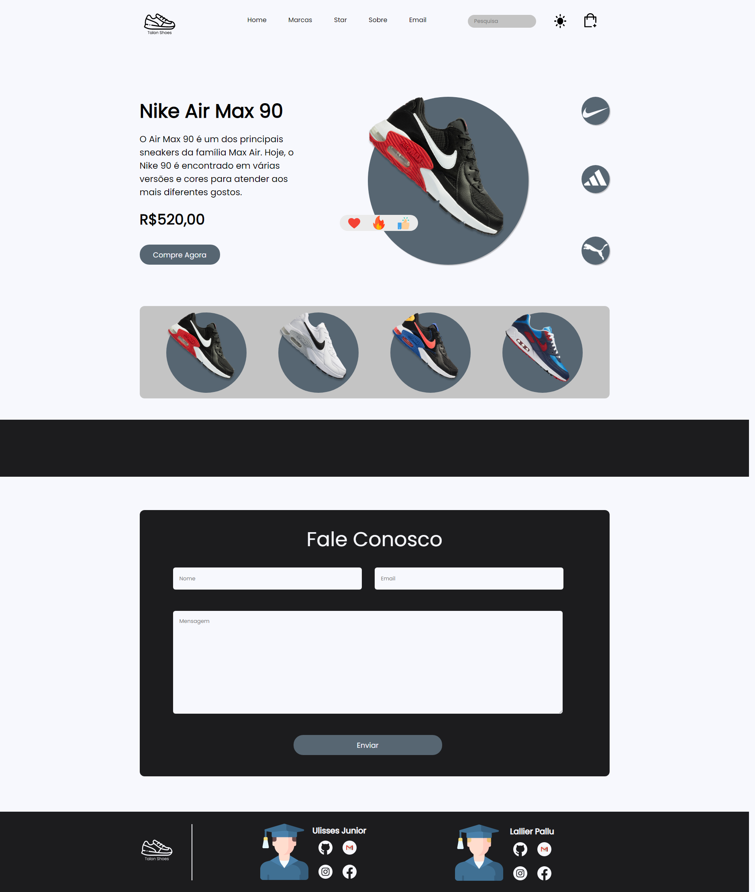
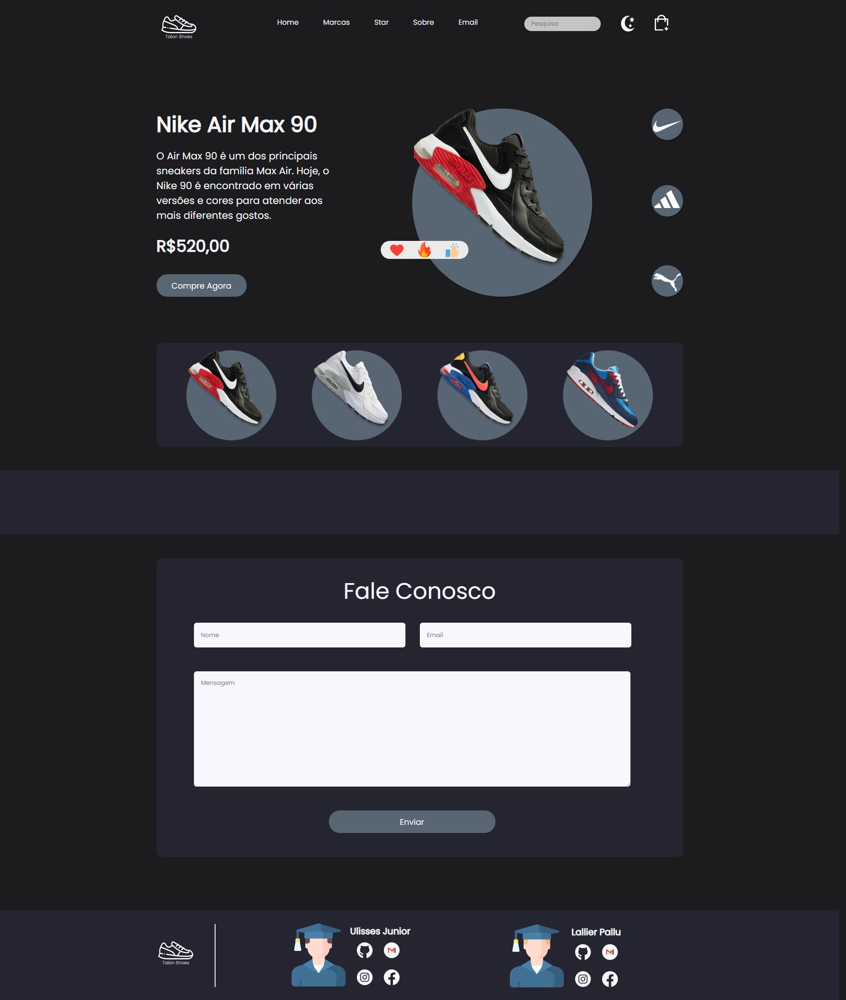
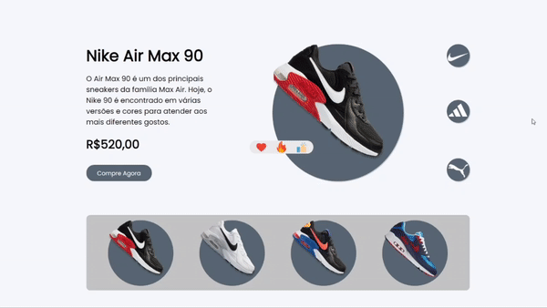
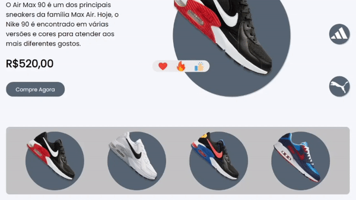
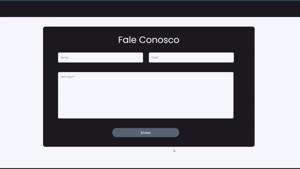

# Talon_Shoes
Em uma oportunidade de estágio que surgiu na área de desenvolvimento web, eu (Ulisses) e meu amigo (Lallier) desenvolvemos esse site em 3 dias, dias esses que envolveram partes de designer e programação.

## Dark Mode
Na parte de javascript desenvolvemos um modo noturno, que a partir do click no botão sun troca as cores iniciais para as cores dark.

## Slider
Ainda dentro do javascript, desenvolvemos 3 botões laterais que alteram as marcas dos tênis, textos e preços dos mesmos.

  
## Animation
Dentro do CSS, desenvolvemos pequenas animações que deixam o site mais intuitivo com o usuário.

## Fale conosco
Misturando o css e o javascript, desenvolvemos uma aba "fale conosco" onde o usuário pode entrar em contato com a loja pelo site da mesma.

  
## Rodapé
Dentro do rodapé, colocamos 2 bonecos simbolizando os desenvolvedores (Ulisses e Lallier) e ao lado buttons com as redes sociais: Github, Gmail, Instagram e Facebook.

## Demo
Para testar acesse o link: 
<a href="https://ulissesjunior.github.io/Talon_Shoes/" target="_blank" >Talon Shoes</a>
  
© Copyright 2021 Ulisses Douglas de Paula Assis Junior, Lallier Pallu Cardoso de Faria - Todos os direitos reservados
